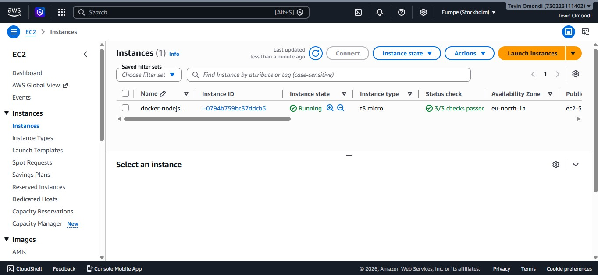

# Dockerized Node.js Application on AWS EC2

A production-style deployment of a Dockerized Node.js web application on an Amazon EC2 instance. The application is containerized using Docker, deployed on Ubuntu, and made accessible over the internet through an EC2 public IP.

---

## Project Overview

This project demonstrates how to:

- Build a Docker image for a Node.js application
- Deploy the container on an AWS EC2 Ubuntu instance
- Configure security groups for web traffic
- Access the application through a browser
- Manage Docker containers on Linux
- Push the project to GitHub with documentation

---

## Architecture

```text
                    +----------------------+
                    |      Developer       |
                    |  VS Code + GitHub    |
                    +----------+-----------+
                               |
                               |
                               v
                     Docker Build Image
                               |
                               v
                    +----------------------+
                    |   Docker Image       |
                    +----------+-----------+
                               |
                               |
                               v
                    Amazon EC2 (Ubuntu 24.04)
                 +-----------------------------+
                 |        Docker Engine        |
                 |                             |
                 |  Node.js Container          |
                 |      Port 3000              |
                 +-------------+---------------+
                               |
                               |
                     Security Group (3000)
                               |
                               |
                               v
                        Web Browser
```

---

## Technologies Used

- AWS EC2
- Ubuntu 24.04 LTS
- Docker
- Node.js
- Git
- GitHub
- PowerShell
- VS Code

---

## Project Structure

```
docker-nodejs-ec2/
│
├── app/
│   ├── package.json
│   ├── server.js
│   └── public/
│       ├── index.html
│       ├── styles.css
│       └── script.js
│
├── Screenshots/
│   ├── EC2.jpg
│   ├── ssh terminal.jpg
│   ├── docker images.jpg
│   ├── docker ps.jpg
│   ├── browser showing app.jpg
│   └── docker repository.jpg
│
├── Dockerfile
├── .dockerignore
├── .gitignore
└── README.md
```

---

## Deployment Steps

### 1. Launch EC2 Instance

- Ubuntu 24.04 LTS
- t3.micro
- Configure Security Group
  - SSH (22)
  - HTTP (80)
  - Custom TCP (3000)

---

### 2. Connect via SSH

```bash
ssh -i docker-nodejs-key.pem ubuntu@<EC2-Public-IP>
```

---

### 3. Install Docker

```bash
sudo apt update

sudo apt install docker.io -y

sudo systemctl enable docker

sudo systemctl start docker

sudo usermod -aG docker ubuntu
```

Reconnect to activate Docker permissions.

---

### 4. Build Docker Image

```bash
docker build -t docker-nodejs-app .
```

---

### 5. Verify Image

```bash
docker images
```

---

### 6. Run Container

```bash
docker run -d -p 3000:3000 --name node-app docker-nodejs-app
```

---

### 7. Verify Running Container

```bash
docker ps
```

---

### 8. Test Locally

```bash
curl http://localhost:3000
```

---

### 9. Access Application

```
http://<EC2-Public-IP>:3000
```

---

# Screenshots

## EC2 Instance



---

## SSH Connection


---

## Docker Images


---

## Running Container


---

## Application Running


---

## Docker Hub Repository


---

# Docker Commands Used

Build image

```bash
docker build -t docker-nodejs-app .
```

List images

```bash
docker images
```

Run container

```bash
docker run -d -p 3000:3000 --name node-app docker-nodejs-app
```

View running containers

```bash
docker ps
```

Stop container

```bash
docker stop node-app
```

Start container

```bash
docker start node-app
```

Remove container

```bash
docker rm node-app
```

---

## Learning Outcomes

This project demonstrates proficiency in:

- Docker containerization
- AWS EC2 deployment
- Linux administration
- Node.js application deployment
- Git & GitHub version control
- Docker networking
- Infrastructure deployment
- Cloud computing fundamentals

---

## Future Improvements

- Deploy using Docker Compose
- Configure Nginx reverse proxy
- Secure with HTTPS using Let's Encrypt
- Implement GitHub Actions CI/CD
- Push images automatically to Docker Hub
- Deploy automatically after every GitHub push
- Monitor containers with CloudWatch

---

## Author

**Tevin Omondi**

Cloud & DevOps Engineer

GitHub: https://github.com/tevinomondifreelance-design
